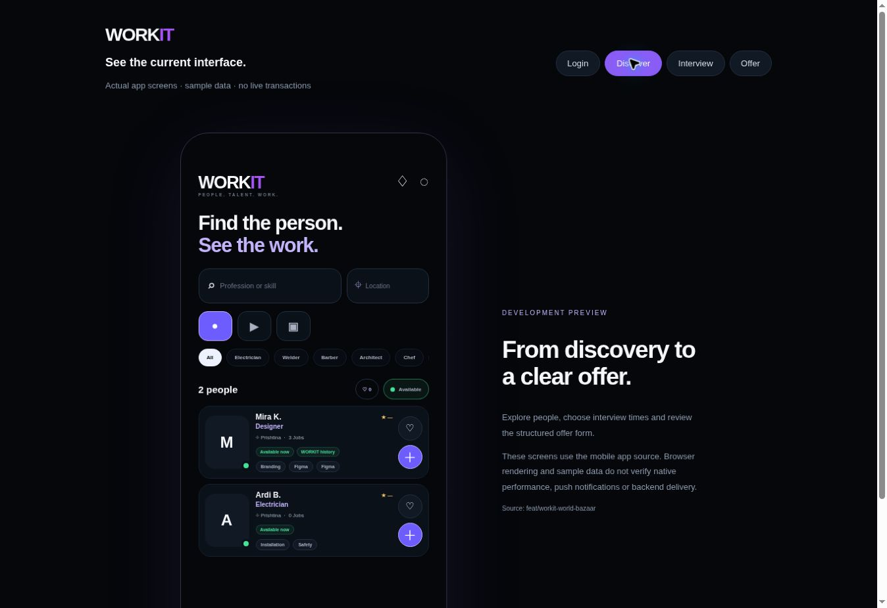

# Current WORKIT app preview

Open https://njomzadomi-hub.github.io/WORKIT/current-app-preview.html

This page bundles the actual Login, Explore, ScheduleInterview, SendOffer, ForgotPassword and ResetPassword components from workit-mobile, commit a56d6dd57eb7d9256c07119386bc51f8d42e9639. It uses sample services and sends no login credentials, messages, applications or offers.

Browser QA: the original four screens rendered; new recovery screens are included for visual review. An impossible interview date showed a validation message; a future slot showed the candidate preview; an impossible offer start date showed a validation message. Discovery displayed both sample profiles. These checks do not replace physical-device or backend integration QA.

